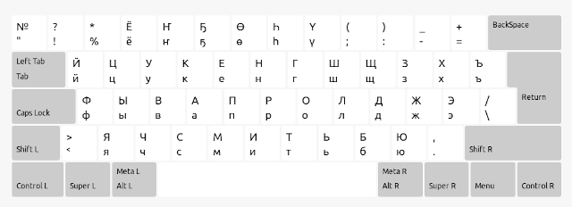
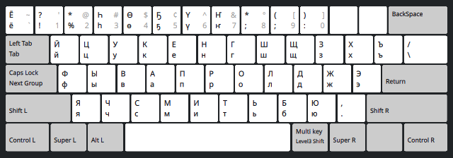

# Sakha keyboard layout for XKB

In other languages:
* [Есть версия этой инструкции по русски](README.ru.md)

# Variants

This Sakha keyboard layout comes with three distinct variants.

## MS Windows (default)

(Almost) exact replica of the Russian layout by Microsoft Windows
with five "extra" Sakha letters ҤҔӨҺҮ located in the top row replacing the numbers from 4 to 8.
But almost exact is not exact. This variant comes with a few tweaks:
* Unlike the original Windows one this layout has the Russian letter "Ё" replacing the numeric key "3" which completes the Russian alphabet and let one layout be used for both languages.
* The ligature "Дь" is omitted as it's not actually used in Sakha typography.
* The numerals, besides the numpad, can be typed with Alt-R (Multi key Level3 shift).

## he5yH

The legendary layout also known as "ҺӨҔҮҤ" that existed since the begining of the century
and become a de facto standard when there were no standards. Added as a variant to this
layout for backward compatibility and for retro enthusiasts.

## Phonetic (Android)

Alternative keyboard layout (experimental) that is phonetically follows the English QWERTY.
It existed as a variant of a Sakha keyboard for Android as an extention for AnySoftKeyboard.
The main advantage of this variant is that it uses exactly 26 alphabetiical keys of a
standard QWERTY keyboard which makes it compatible with custom portable keyboards
such as e.g. "Smart" TV remotes. It also can be used by those who are used to QWERTY
layouts and don't want to learn ЙЦУКЕНГ. This phonetic variant omits "purely Russian"
cyrillic letters that are not natural in Sakha language, e.g. Я, Ё, Ж, Ш, etc.
However they can be enterd with the Right Alt key.

# How to install

Download a zip archive from [the latest release](https://github.com/kyraha/sah-xkb/releases/latest)
and unpack it on your local drive. Then...

## TL;DR or Scripted local user installation

1. `cd <path/to/unpacked/sah-xkb>`
1. `./install-local.sh`

Then open your system settings, keyboard, or language, or input methods,
or whatever the option to add new keyboard layouts in your system is.
The Sakha language should now be available in the list.

## No scripts, manual local user installation

Don't trust scripts? -- No problem. You can install this package manually too.

1. Make sure you don't have other XKB settings in your local `$HOME/.config/xkb`
1. If you have other settings make sure you won't overwrite them with these manual steps
1. `mkdir -p $HOME/.config/xkb`
1. `cp -r sah-xkb/rules $HOME/.config/xkb/`
1. `cp -r sah-xkb/symbols $HOME/.config/xkb/`

Then open your system settings, keyboard, or language, or input methods,
or whatever the option to add new keyboard layouts in your system is.
The Sakha language should now be available in the list.

## System wide installation

To install the custom keyboard layout on the whole system one must have a root (administrator)
permissions on that system. The following instructions assume that you have gained
such access in a terminal as well as you take full responsibility on any damages to
the system you may or may not inadvertently caused while possessing the rights.
Search and read more about `su -` or `sudo sh` commands. You've been warned.

Another assumption is that the XKB configuration files reside in `/usr/share/X11/xkb`
in your system.

This approach has been tested in Ubuntu 12.04, and later in Ubuntu 20.04, and even
in Arch Linux with KDE Plasma 6 on Wayland. It has worked equally well on all of
aforementioned systems.
Probability is high, that it will work in any other Linux and Unix-like systems that
use XKB (X keyboard extension). You may alter the process as you feel fit
if you know what you're doing.

1. Become root
1. Copy file `symbols/sakha` to `/usr/share/X11/xkb/symbols/`
1. Open `rules/evdev.xml` in a text editor and study its XML content
1. Open `/usr/share/X11/xkb/rules/evdev.xml` in a separate editor and find a spot
where you can insert a new `<layout>` item. Usually the "layouts" in this file are sorted in
the alphabetical order. So it might make sense to insert "sah" between "rs" and "si".
Hint: serch for "Slovenian".
1. Copy and paste the block between and including the `<layout>` and `</layout>`
from the downloaded file into the system `evdev.xml`.
1. Save the file.

That's it. In the system settings where you usually can activate keyboard layouts you should
see the new language "Sakha" with a few variants. Depending on your Desktop Environment and
Window Manager it could be: "Settings" -> "Region & Language" -> "Input Sources" -> "+ Add".
Try "More" or "Other". You might need to logout and log back in again if it doesn't appear.

:copyright: 2025 Kyraha Mikhail
