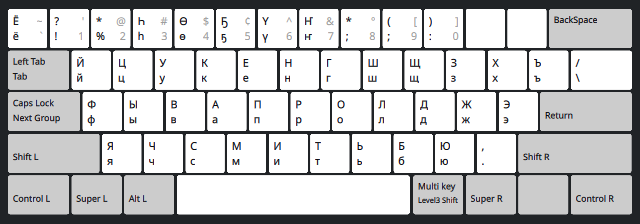
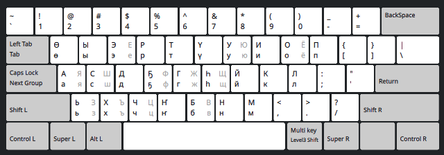

# Якутская Раскладка Клавиатуры для Линукс

На других языках:
* [For English click here](README.md)

# Варианты раскладок

## Вариант MS Windows

[Почти] в точности повторяет раскладку от Майкрософт, где пять якутских букв ҤҔӨҺҮ расположены по верхнему ряду клавиатуры вместо цифр 4-8. В отличие от MS Windows, присутствует русская буква Ё на цифре 3, что делает алфавит полным и поэтому не требует использования отдельной русской раскладки. Сдвоенная буква Дь тоже убрана за ненадобностью и клавиша 2 используется для других полезных знаков. Цифры можно набирать, используя правую клавишу Alt. Экспериментируйте.

## he5yH

Старая легендарная раскладка ҺӨҔҮҤ, которая была создана давно, ещё в начале этого столетия, когда никаких стандартов не существовало. Оставлена для обратной совместимости и для любителей ретро.

## Phonetic (Android)

Альтернативная раскладка, экспериментальная, фонетически напоминает английскую QWERTY, в точности как на телефонах Андроид с драйвером AnySoftKeyboard, и использует ровно 26 алфавитных клавиш минимальной английской клавиатуры, что делает её совместимой с заказными миниатюрными клавиатурами (типа пульт ДУ для "умных" телевизоров). А ещё может быть полезной для тех кто привык к QWERTY, т.к. не требует переучивания на ЙЦУКЕНГ и никаких дополнительных наклеек. К тому же не содержит лишних (русских) букв, таких как Я, Ё, Ж, Ш и т.д., хотя доступ к ним всё-равно есть через правую клавишу ALT (как показано на этом снимке).

## Раскладка ГОСТ отсутствует

Раскладка с использованием ALT по постановлению Правительства РС(Я) из данной разработки убрана, как не имеющая практической ценности. К тому же, она уже реализована в последних дистрибутивах Линукс в языковом разделе "Russian" под вариантом "Yakut".

PS: Если у Вас система не Убунту Линукс, то настройки xkb могут оказаться в /usr/X11R6/lib/X11/xkb/ или /etc/X11/xkb/ или в любом другом месте. Ищите внимательно.

# Установка

Скачайте zip файл из раздела [the latest release](https://github.com/kyraha/sah-xkb/releases/latest)
и распакуйте его к себе на локальный "диск". Затем...

## Способ "Мне лень. Куда нажимать?"

1. `cd <в/папку/куда/распакован/sah-xkb>`
1. `./install-local.sh`

Потом откройте системные настройки и найдите, где настраиваются раскладки клавиатур.
Это может быть что-то типа "keyboard", или "language", или "input methods".
Найдите там Sakha и нажмите "добавить".

## Без скриптов, всё вручную

Не доверяете установочным скриптам? -- Не проблема. Эту раскладку можно установить и вручную.

1. Сначала убедитесь, что ничего ещё не установлено в `$HOME/.config/xkb`
1. Если что-то уже в этой папке есть, изучите внимательно и убедитесь, что вы ничего не
сломаете следующими действиями
1. `mkdir -p $HOME/.config/xkb`
1. `cp -r sah-xkb/rules $HOME/.config/xkb/`
1. `cp -r sah-xkb/symbols $HOME/.config/xkb/`

Потом откройте системные настройки и найдите, где настраиваются раскладки клавиатур.
Это может быть что-то типа "keyboard", или "language", или "input methods".
Найдите там Sakha и нажмите "добавить".

## На всю систему Linux

Настоящая инструкция была написана для Ubuntu 12.04, но позднее также была опробована на Ubuntu 20.04, И даже Arch Linux with KDE Plasma. Работает одинаково. Возможно, всё это будет работать и в других версиях Линукса и других Юникс-образных системах. Если Вы знаете, что Вы делаете, то подогнать процесс установки под Вашу конфигурацию не составит большого труда.

1. Станьте рутом (root). Например командой `su -` или `sudo sh`
1. Возьмите файл sakha из директории "symbols" этого репозитория.
1. Скопируйте его в свой /usr/share/X11/xkb/symbols/ (или туда, где ваши xkb файлы лежат).
1. Откройте файл evdev.xml из директории "rules". (Нет, этот файл не надо никуда копировать) и изучите его XML содержимое.
1. Откройте в другом окне редактора Ваш системный `/usr/share/X11/xkb/rules/evdev.xml` и найдите там место, куда вставить новый `<layout>`. Обычно они там отсортированы в алфавитном порядке по коду языка, поэтому имеет смысл воткнуть нашу "sah" раскладку между сербской "rs" и словакской "si". Совет: сделайте поиск по тексту на слово "Slovenian".
1. Скопируйте весь текст от тэга `<layout>` до тэга `</layout>` включительно из скачанного файла evdev.xml и вставьте его в ваш системный evdev.xml
1. Сохраните файл.

Всё. После этого в настройках многоязыковой клавиатуры должен появиться язык "Sakha" с разными вариантами раскладок. "Settings" -> "Region & Language" -> "Input Sources" -> "+". Ищите в разделе "Other" на букву "S" (Sakha). Если не появился, попробуйте перезагрузить Х. Например, "Log Out" а потом обратно "Log In".

:copyright: 2020-2025 Кыраһа Михаил
