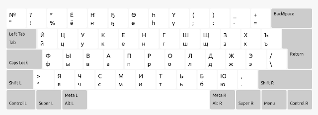
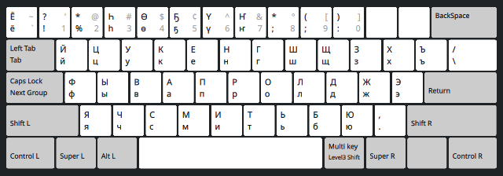
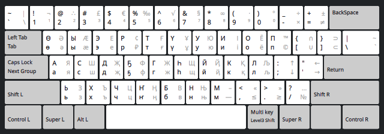

# Сахалыы XKB Кылабатыыра Аттарыыта

Атын тылынан:
* [For English click here](README.md)
* [Есть версия этой инструкции по русски](README.ru.md)

# Араастара

Бу сахалыы кылабатыыра аттарыыта үс туспа көрүҥнээх. Үс көрүҥ манныктар:

## 1. MS Windows (аан турук)

Microsoft Windows нууччалыы аттарыытын копия кэриҥэ. Чопчу Windows курдук
биэс "эбии" сахалыы ҤҔӨҺҮ буукубалаар үөһээҥҥи кэккэҕэ
түөрт сыыппараттан аҕыска дылы тимэхтэри солбуйаллар.
Ол гынан баран, бу көрүҥ аҕыйах уларыйыылаах:
* Бу раскылаадка нууччалыы "Ё" буукубалаах, үс диэн сыыппараны солбуйар. Оннук буолан нуучча алпаабыыта толору буолар. Ол иһин биир аттарыы икки тылга иккиэннаригэр туттуллуон сөп.
* "Дь" лигатура Юникодка суох, уонна саха типографиятыгар дьиҥинэн туттуллубат, бары "д" + "ь" диэн бэчээттииллэр син биир. Ол иһин бу аттарыытыттан быраҕыллыбыт.
* Сыыппаралары Alt-R (Multi key Level3 shift) көмөтүнэн суруйуохха син.

## 2. he5yH

Үйэ саҕаланыаҕыттан, туох да стандарт суох кэмигэр үөскээбит, бэйэтэ де-факто стандарт буолбут, "ҺӨҔҮҤ" диэн киэҥник биллэр легендарнай расклаадката. Төттөрү сөп түбэһиигэ уонна ретро энтузиасттарыгар аналлаах буоллун дин оҥоһуллубут.
Бэрт Дьиктигэ махтал!

## 3. Фонетическай (Андроид курдук)

Өссө биир кылабатыыра оҥоһуута (экспериментальнай), фонетическай өттүнэн английскай QWERTY-ны тутуһар.
Android-ка баар AnySoftKeyboard сахалыы клавиатура кэҥэтиитин арааһа быһыытынан баара.
Бу аттарыы сүрүн үчүгэйэ диэн, стандартнай QWERTY кылабатыыратын 26 латыынныы алпабыыт клавишатын эрэ туһанар.
Ол иһин, эҥин араас кыра, холобура көтөҕүллэр, сиэпкэ угуллар клавиатураларга, эбитэр "Смарт" телевизор пульталарга
туттуллуон сөп. Бу аттарыыта маннык ордуктаах:
* ЙЦУКЕН-ҥа наадыйбат QWERTY-га үөрэммит дьон үргүдьү туттуохтарын сөп.
* "Наар нууччалыы", саха тылыгар дьикти буукубалар, хол. Я, Ё, Ж, Ш уо.д.а. Alt-R кэннигэр симиллибиттэр
* Alt-R-ынан атын да дьикти симболлары киллэриэххэ сөп: Њ Ҋ ₽ ™ « » Љ € № эҥин.
* Бар сахалыы төрүт буукубалар биир кэлим үс кэккэҕэ бааллара сахалыы суруйааһын олус быдан түргэтиир, үөрэннэххэ.

# Компьютерга Туруорааһын

[the latest release](https://github.com/kyraha/sah-xkb/releases/latest) сирэйтэн zip архыыбын хачайдаан ыл
уонна локальнай диискаҕар хостоо. Онтон, аныгы опциялартан биири тал:

## Наһаа уһуннук кэпсээмэ. Ханна баттыыбын көрдөр.

1. Архыыптан хостоммут `install-local.sh` програамманы ыыт. Бүттэ.

Эбэтэр, терминаал түннүгэр:
1. `cd <path/to/unpacked/sah-xkb>`
1. `./install-local.sh`

Ол кэнниттэн систиэмнэй туруорууларгын, клавиатуураҕын, эбэтэр тыл аттарыыларгын, эбэтэр киллэрии ньымаларын арый.
Саха тыла испииһэккэ көстүөхтээх. Sakha диэн S- буукубаттан саҕаланарын көрдөө.
Көстүбэтэҕинэ, сороҕор тахсан баран төттөрү киирдэххинэ эрэ үлэлээччи.

## Илиинэн туруоруу

Бэлэм програаммаларга эрэммэт буоллаххына, бу аттарыыны илиигинэн да туруоруоххун сөп.

1. Локальнай `$HOME/.config/xkb` атын XKB настройкалара суохтарын бэрэбиэркэлээ
1. Атын настройкалара баар буоллахтарына, аныгы оҥоһуллар хардыыларынан ону алдьаппаккын курдук мэктиэлээ
1. `mkdir -p $HOME/.config/xkb`
1. `cp -r sah-xkb/rules $HOME/.config/xkb/`
1. `cp -r sah-xkb/symbols $HOME/.config/xkb/`

Бүттэ. Систиэмнэй туруорууларгын, клавиатуураҕын, эбэтэр тыл аттарыыларгын, эбэтэр киллэрии ньымаларын арый.
Саха тыла испииһэккэ көстүөхтээх. Sakha диэн S- буукубаттан саҕаланарын көрдөө.
Көстүбэтэҕинэ, сороҕор тахсан баран төттөрү киирдэххинэ эрэ үлэлээччи.

## Систиэмэ үрдүнэн туруоруу

Бүтүн систиэмэҕэ саҥа клавиатура оҥоһуутун туруорарга root (администратор) бырааптаах буолуохтааххын. Бу инструкция
итинник бырааптаах терминалга киирэ сылдьан, өйдөөбөккө ханнык баҕарар алдьархайы оҥорбут эбэтэр оҥорботох эн толору эппиэтинэһи ылаҕын дии саныыр. `su -` эбэтэр `sudo sh` хамаандалар тустарынан сиһилии көрдөө уонна аах. Сэрэтэллибиккин.

Үгүс дьоҥҥо система аан үрдүнэн клавиатуураны туруорааһын үксүн наадата суох буолааччы.
Тугу гынаргын билэр буоллаххына эрэ бу опцияны талыахтааххын.

Өссө биир сабаҕалааһын: XKB конфигурационнай файллара эн систиэмэҕэр `/usr/share/X11/xkb` диэн сиргэ сыталлар үһү.

Бу ньыма Ubuntu 12.04-кэ, онтон кэлин Ubuntu 20.04-кэ, оннооҕор
Wayland-наах KDE Plasma-лаах Arch Linux-ка бэрэбиэркэлэммитэ. Барыларыгар тэҥҥэ үчүгэйдик үлэлээтэ.
Атын да Linux уонна Unix курдук, XKB (X клавиатура кэҥэтиитин) туттар систиэмэлэргэ үлэлиэ диэн улахан буолар кыахтааҕа. Тугу гынаргын билэр буоллаххына, сөпкө гынарыҥ диэн сананаргынан процеһы уларытыаххын сөп.

1. Силис буол! һы-һы :) - `root` быраабын ылын.
1. `symbols/sakha` билэни `/usr/share/X11/xkb/symbols/` диэн ыйдарыыга көһөр
1. Тиэкис эрэдээктэригэр `rules/evdev.xml` билэни арый уонна XML ис хоһоонун үөрэт
1. Туспа редакторга `/usr/share/X11/xkb/rules/evdev.xml` системнай билэни арый уонна саҥа `<layout>` элемены ханна киллэриэххин сөп сири бул. Бу билэҕэ баар "лыайауттар" үксүгэр алпабыыт бэрээдэгинэн турааччылар. Онон "sah" диэни "rs" уонна "si" икки ардыларыгар киллэрэр ордук буолуо.
Өйдөтүү: "Slovenian" диэни көрдөө.
1. Хачайдаммыт билэттэн `<layout>` уонна `</layout>` (киллэрэн туран) икки ардыларыгар баарын барытын көһөрөн киллэр.
1. Саҥа уларыппыт системнай билэххин харай.

Бүттэ. Систиэмэ настройкаларыгар, мэлдьи клавиатура раскладкаларын активациялыыр сиригэр, хас да варианнаах "Sakha" диэн саҥа тылы булуохтааххын. Үлэ остуолун эйгэтиттэн эбэтэр Window Manager-тан тутулуктаах маннык буолуон сөп: "Настройкалар" -> "Регион уонна тыл" -> "Источники ввода" -> "+ Добавить".
"Эбии" эбэтэр "Атын" диэни баттаан боруобалаа.
Көстүбэтэҕинэ, сороҕор тахсан баран төттөрү киирдэххинэ эрэ үлэлээччи.

:copyright: 2025 Кыраһа Мэхээлэ
