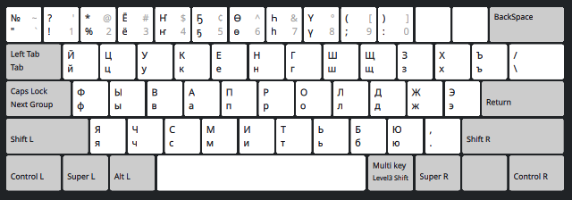

# Сахалыы XKB Кылабатыыра Аттарыыта

Атын тылынан:
* [For English click here](README.md)
* [Есть версия этой инструкции по русски](README.ru.md)

# Араастара

Бу сахалыы кылабатыыра аттарыыта үс туспа көрүҥнээх.

## 1. MS Windows (аан турук)

Microsoft Windows оҥорбут нууччалыы аттарыы копиятын кэриҥэ. Чопчу Windows курдук
биэс "эбии" сахалыы ҤҔӨҺҮ буукубалаар үөһээ кэккэҕэ
түөртэн аҕыска диэри сыыппаралары солбуйаллар.
Ол гынан баран, бу көрүҥэ аҕыйах уларыйыылаах:
* Бу раскладка нууччалыы "Ё" буукубалаах, үс диэн сыыппараны солбуйар. Оннук буолан нуучча алпаабыыта толору буолар. Ол иһин биир аттарыы икки тылга иккиэннаригэр туттуллуон сөп.
* "Дь" лигатура саха типографиятыгар дьиҥинэн туттуллубат, уонна Юникодка син биир суох. Ол иһин бу аттарыытыттан быраҕыллыбыт. 
* Сыыппаралары Alt-R (Multi key Level3 shift) көмөтүнэн суруйуута эбиллибит.

## 2. he5yH

Үйэ саҕаланыаҕыттан, туох да стандарт суох кэмигэр үөскээбит, де-факто стандарт буолбут, "ҺӨҔҮҤ" диэн киэҥник биллэр легендарнай расклаадката. Төттөрү сөп түбэһиигэ уонна ретро энтузиасттарыгар аналлаах буоллун дин оҥоһуллубут.

## 3. Фонетическай (Андроид курдук)

Өссө биир кылабатыыра оҥоһуута (экспериментальнай), фонетическай өттүнэн английскай QWERTY-ны тутуһар.
Android-ка баар AnySoftKeyboard сахалыы клавиатура кэҥэтиитин арааһа быһыытынан баара.
Бу аттарыы сүрүн үчүгэйэ диэн, стандартнай QWERTY кылабатыыратын 26 латыынныы алпабыыт клавишатын эрэ туһанар.
Ол иһин, эҥин араас кыра, холобура туспа көтөҕүллэр клавиатураларга, эбитэр "Смарт" телевизор пульттарга
туттуллуон сөп. Ол эрээри, дьөссө QWERTY-га үөрэммит, ЙЦУКЕҤҥа үөрэниэхтэрин баҕарбат дьон эмиэ туттуохтарын сөп.
Бу фонетическай көрүҥэр "наар нууччалыы", саха тылыгар дьикти кириллица буукубалары (хол. Я, Ё, Ж, Ш уо.д.а.)
Right Alt кнопканан киллэриэххэ сөп.

# Компьютерга Туруорааһын

[the latest release](https://github.com/kyraha/sah-xkb/releases/latest) сирэйтэн zip архыыбын хачайдаан ыл
уонна локальнай диискаҕар хостоо. Онтон...

## Наһаа уһуннук кэпсээмэ. Ханна баттыыбын көрдөр.

1. Архыыптан хостоммут `install-local.sh` програамманы ыыт. Бүттэ.

Эбэтэр, терминаал түннүгэр:
1. `cd <path/to/unpacked/sah-xkb>`
1. `./install-local.sh`

Ол кэнниттэн систиэмнэй туруорууларгын, клавиатуураҕын, эбэтэр тыл аттарыыларгын, эбэтэр киллэрии ньымаларын арый.
Саха (Sakha) тыла испииһэккэ баар буолуохтаах.
S- буукубаттан саҕаланарын көрдөө.

## Илиинэн туруоруу

Бэлэм програаммаларга итэҕэйбэккин буоллаҕына, бу аттарыыны илиигинэн да туруоруоххун сөп.

1. Локальнай `$HOME/.config/xkb` атын XKB настройкалара суохтарын бэрэбиэркэлээ
1. Атын настройкалара баар буоллаҕына, ону аныгы илиинэн оҥоһуллар хардыыларынан алдьаппаккын курдук диэн мэктиэлээ
1. `mkdir -p $HOME/.config/xkb`
1. `cp -r sah-xkb/rules $HOME/.config/xkb/`
1. `cp -r sah-xkb/symbols $HOME/.config/xkb/`

Бүттэ. Систиэмнэй туруорууларгын, клавиатуураҕын, эбэтэр тыл аттарыыларгын, эбэтэр киллэрии ньымаларын арый.
Саха (Sakha) тыла испииһэккэ баар буолуохтаах.
S- буукубаттан саҕаланарын көрдөө.

## Систиэмэ үрдүнэн туруоруу

Бүтүн систиэмэҕэ саҥа клавиатура оҥоһуутун туруорарга root (администратор) бырааптаах буолуохтааххын. Бу  инструкция
итинник бырааптаах терминалга киирэ сылдьан, өйдөөбөккө ханнык баҕарар алдьархайы оҥорбут эбэтэр оҥорботох эн толору эппиэтинэһи ылаҕын дии саныыр. 
`su -` эбэтэр `sudo sh` хамаандалар тустарынан сиһилии көрдөө уонна аах. Сэрэтэллибиккин.

Өссө биир сабаҕалааһын: XKB конфигурационнай файллара эн систиэмэҕэр `/usr/share/X11/xkb` диэн сиргэ сыталлар үһү.

Бу ньыма Ubuntu 12.04-кэ, онтон кэлин Ubuntu 20.04-кэ, оннооҕор
Wayland-наах KDE Plasma-лаах Arch Linux-ка бэрэбиэркэлэммитэ. Барыларыгар тэҥҥэ үчүгэйдик үлэлээтэ.
Атын да Linux уонна Unix курдук, XKB (X клавиатура кэҥэтиитин) туттар систиэмэлэргэ үлэлиэ диэн улахан буолар кыахтааҕа. Тугу гынаргын билэр буоллаххына, сөпкө гынарыҥ диэн сананаргынан процеһы уларытыаххын сөп.

1. Силис буол! :) `root` быраабын ылын.
1. `symbols/sakha` билэни `/usr/share/X11/xkb/symbols/` диэн ыйдарыыга көһөр
1. Тиэкис эрэдээктэригэр `rules/evdev.xml` билэни арый уонна XML ис хоһоонун үөрэт
1. Туспа редакторга `/usr/share/X11/xkb/rules/evdev.xml` системнай билэни арый уонна саҥа `<layout>` элемены киллэриэххин сөп сири бул. Бу билэҕэ баар "лыайауттар" үксүгэр алпабыыт бэрээдэгинэн турааччылар. Онон "sah" диэни "rs" уонна "si" икки ардыгар киллэрэр ордук буолуо.
Өйдөтүү: "Slovenian" диэни көрдөө.
1. Хачайдаммыт билэттэн `<layout>` уонна `</layout>` (киллэрэн туран) икки ардыларыгар баар блоку көһөрөн киллэр.
1. Билэххин харай.

Бүттэ. Систиэмэ настройкаларыгар, мэлдьи клавиатура раскладкаларын активациялыыр сиригэр, хас да варианнаах "Sakha" диэн саҥа тылы булуохтааххын. Үлэ остуолун эйгэтиттэн эбэтэр Window Manager-тан тутулуктаах маннык буолуон сөп: "Настройкалар" -> "Регион уонна тыл" -> "Источники ввода" -> "+ Добавить".
"Эбии" эбэтэр "Атын" диэни баттаан боруобалаа. Көстүбэтэҕинэ, баҕар тахсан баран төттөрү киириэххтээхин буолуо.

:copyright: 2025 Кыраһа Мэхээлэ
